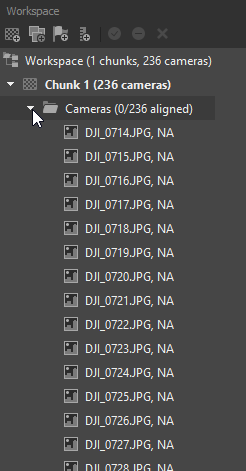

This tutorial will guide to create **3D point cloud**, **Digitla Elevation Model (DEM)**, and **Ortho-Mosaic** from your UAV-borne RGB images (*e.g. DJI FC330*). This tutorial use **Agisoft PhotoScan** software.

## Image export

* Copy camera images (JPGs) to the local folder in your computer from the micro SD card of the drone.
* Right click one of the image and click the properties and check the location data under the GPS section in the 'Detail' tab.

## Pre proceedure

* Open Agisoft PhotoScan.
* Click *Workflow* drop down menu and click *Add photos*. See Figure 1a.
* Browse to your folder and add all *JPG* files.
* *Workspace* shows loaded images as a list under *Chunk1* and *Cameras*. See the Figure 1b.
* The loaded photos can be seen on the *Photos* pane in the lower of the software GUI.
* In the *Model* pane, camera positions are shown with respective image names. Camera position can be turn on/off by clicking the *Camera* icon in the top tool bar.
* To view the images' geotag data (including roataion angles), click *Reference* tab at lower left. See the Figure 1c.

* Before starting the next process, change the coordinate system to your local coordinate system to match the coordinate system with your GCP coordinates. To change it, click *Convert* icon in the *Reference* pane. Select your coordinate system and click *OK* in the new window. See the Figure 2a.

## SFM process

> **Structure From Motion (SFM)** process generatew 3D data from overlapping images. The input for the process is overlapping images with geo-tag data. GCP can be utlised to get an geo-referenced output. *The Dense Point Cloud*, *The Mesh*, *The Digital Elevation Model (DEM)*, and *The Digital Orthomosaic (DOM)* are the main outputs from the SFM process.

