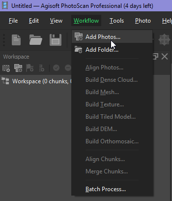
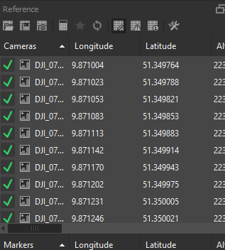
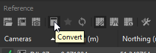
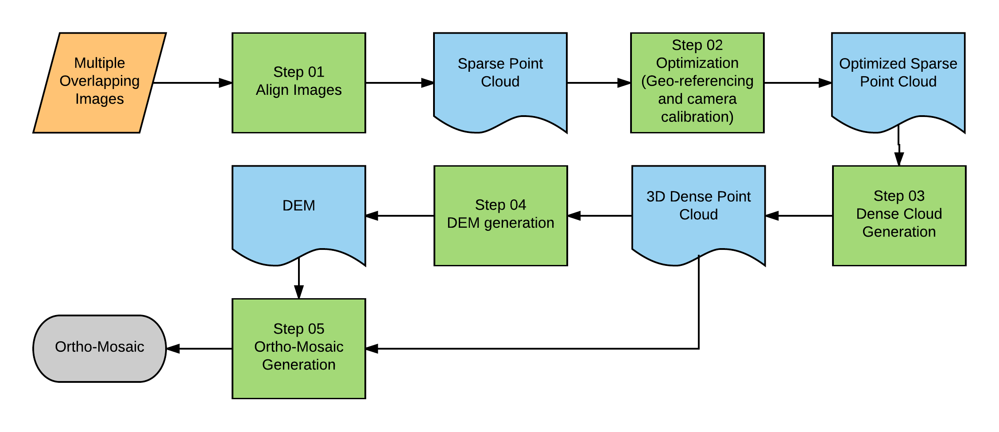
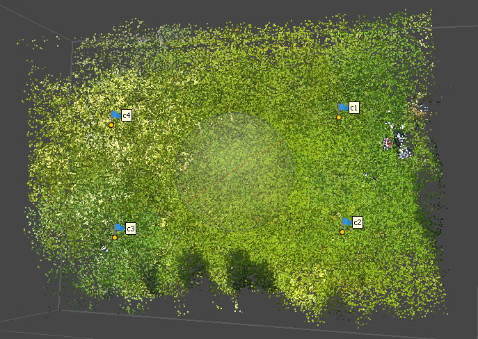

This tutorial will guide to create **3D point cloud**, **Digitla Elevation Model (DEM)**, and **Ortho-Mosaic** from your UAV-borne RGB images (*e.g. DJI FC330*). This tutorial use **Agisoft PhotoScan** software.

## Image export

* Copy camera images (JPGs) to the local folder in your computer from the micro SD card of the drone.
* Right click one of the image and click the properties and check the location data under the GPS section in the 'Detail' tab.

## Pre proceedure

* Open Agisoft PhotoScan.
* Click *Workflow* drop down menu and click *Add photos*. See Figure 1a.
* Browse to your folder and add all *JPG* files.
* *Workspace* shows loaded images as a list under *Chunk1* and *Cameras*. See the Figure 1b.
* The loaded photos can be seen on the *Photos* pane in the lower of the software GUI.
* In the *Model* pane, camera positions are shown with respective image names. Camera position can be turn on/off by clicking the *Camera* icon in the top tool bar.
* To view the images' geotag data (including roataion angles), click *Reference* tab at lower left. See the Figure 1c.

* Before starting the next process, change the coordinate system to your local coordinate system to match the coordinate system with your GCP coordinates. To change it, click *Convert* icon in the *Reference* pane. Select your coordinate system and click *OK* in the new window. See the Figure 2a.

## SFM process

> **Structure From Motion (SFM)** process generatew 3D data from overlapping images. The input for the process is overlapping images with geo-tag data. GCP can be utlised to get an geo-referenced output. *The Dense Point Cloud*, *The Mesh*, *The Digital Elevation Model (DEM)*, and *The Digital Orthomosaic (DOM)* are the main outputs from the SFM process.

### Step 01 - Align photos

Photos are aligned according to the points which are determined from image matching techniques. The output from this step is the **sparse point cloud**.

i) Go to *workflow* drop down menu and click *Align Photos*.
ii) Parameters for *Align Photos*;
    * *Accuracy* - Medium or High (Don't make it to the Highest unless if you have very powerful computer).
    * Tick on *Generic preselection*, *Reference preselection*, and, *Adaptive camera model fitting*.
    * Keep the default *Key point limit*, and *Tie point limit*.
iii) Click *OK* to run the process.
iv) It will take some time (About an hour) and have a break.

After the process, you can see blue squares on the model pane which indicating the actual photos. In the workspace image list, you can see how many photos were aligned out of total photos. If it is successful align process, you could see all photos are aligned. If there are any not aligned photos, there is *NA* after the name of the photo in the list. Select not aligned photos and right click and click *Align Selected Camera*.

### Step 02 - Optimisation

In the optimisation step, the *sparse point cloud* is georeferenced using external GCPs. Additionally, it enhances the camera lens parameters. This is not a mandatory step.

i) Add external GCPs using *import* icon in the Reference pane.
ii) There will be a window asking *Create new marker?*. Click *Yes* or *Yes to all*.
iii) Select all the images in the Reference pane and *uncheck* all the images.
iv) Identify the each marker in the each photo.
v) Double click one of photos which visualises actual GCP (Double clicked photo is opened in new tab in the model pane.
    * Zoom into the GCP.
    * Accurately position your respective marker by right click on the photo and click *place marker*. 
    * Do this for other photos where the same marker appears. (Minimum 5 photos). (Tip: After you selecting two photos for one marker, right click marker on the reference pane and click *Filter photos by Marker*. It filtered all the photos which may have the same marker.)
vi) Follow the same procedure for other GCPs and accurately position them on the respective photos.
vii) After adding more than two GCPs, you can click *update* icon. It changes the model according to new markers.
viii) Finally, check the *Error (m)* and, *Error (pix)*. Then move your markers to reduce the error. Do not forget click *update* after setting up each marker.
ix) At least four markers are needed for the control points. But if you have more than four, you can decide which points for *control points* and which for *check points*. (Always more is the better).
x) After you get reasonable low error click *Optimise Camera* icon (Star Icon) in the reference pane. Then click *OK*.
xi) Check your final error after this process. If it is not enough for your study, move your GCPs again and repeat the optimisation.
xii) The output of this step is georeferenced sparse point cloud.  See the Figure~\ref{fig:sc* for the sparse point cloud after optimisation.

### Step 03 - Build dense cloud

